# AgentScope 深度解读与数字员工平台适配落地方案

> 调研日期：2026-08-18 · 资料基准：AgentScope 官方文档（2.0.x）、GitHub（agentscope-ai）、PyPI、Runtime 官方文档、agentscope.io 官网
> 结论先行：**建议「控制面保留自研、执行面切换 AgentScope、支撑服务自建、沙箱分级接入」**，分四期落地，最终形态是一个面向多租户的数字员工平台。

---

# 第一部分 认识 AgentScope：由浅入深

## 1. 一句话认识 AgentScope

AgentScope 是阿里巴巴通义实验室开源的**智能体全栈技术体系**：从写一个 Agent 的框架，到把 Agent 跑起来的运行时，到调试观测工具，再到训练和进化 Agent 的完整管线，全部开源（Apache-2.0 协议），GitHub 约 2.9 万 star（2026-08）。

把它想象成「数字员工的操作系统底座」：

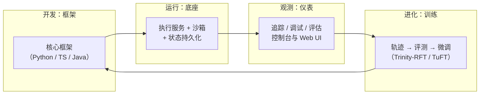

官网对它的定位一句话概括：**开发和运行「你看得见、看得懂、信得过」的 Agent**——这句话里的「透明」是理解 AgentScope 的钥匙，后文反复出现。

## 2. 它是怎么长成今天这样的

了解版本脉络，才能判断「现在上车是否安全」：

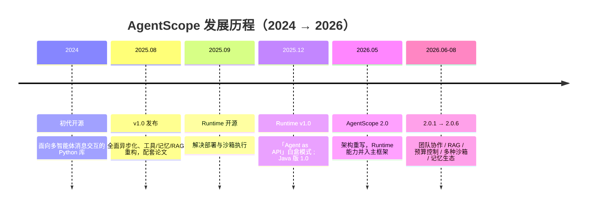

三条主线值得记住：

1. **从「多智能体编排库」进化为「生产级单智能体内核 + 厚基础设施」**。1.0 时代的主打卖点是 pipeline、群聊、消息可视化；2.0 把这些编排语法糖全部移除，只保留一个干净的「思考-行动」循环引擎，把省下的精力投入到权限、沙箱、状态持久化、上下文工程这些生产必需品上。
2. **Runtime 的独立产品生命周期结束了**。2025 年 12 月 Runtime v1.0 确立「Agent as API」范式，2026 年中该仓库归档，能力全部并入 AgentScope 2.0 主框架——今天不存在「要不要单独装 Runtime」的问题，装 2.0 就有了。
3. **迭代速度很快**。2.0.0（2026-05）到 2.0.6（2026-08）三个月发了六个版本，且 2.0 相对 1.0 是不兼容重写。这是机会（能力新）也是风险（要管理升级节奏），第二部分会专门应对。

## 3. 全家桶地图

agentscope-ai 组织下的生态（截至 2026-08）：

| 项目 | 定位 | 对我们的意义 |
|---|---|---|
| agentscope（Python） | 核心框架，2.0.6 | 执行面的引擎 |
| agentscope-typescript + 前端 SDK | TS 版与前端事件同构 | 前端改造可复用 |
| agentscope-java（2.0） | JVM 企业版，原生分布式/多租户 | 若后端是 Java 团队可评估；我们暂不选 |
| ReMe | 文件原生的记忆管理套件 | 长期记忆备选方案 |
| OpenJudge | 统一评测与质量奖励框架 | 自进化闭环的「考官」 |
| Trinity-RFT | 强化微调框架（探索器/训练器/缓冲区三件套） | 自进化闭环的「教练」 |
| TuFT | 多租户微调平台（Tinker 兼容 API） | 多租户场景下的训练基础设施 |
| QwenPaw（前身 CoPaw） | 基于 AgentScope 的个人助理工作站产品 | 产品形态参考（渠道接入、技能、记忆） |
| AgentScope Platform | 开源的 Agent/插件/技能共享平台 | 平台「市场」模块的参照 |
| skills 仓库 | 官方精选技能集 | 技能市场冷启动内容 |

## 4. 设计哲学：把方向盘交给模型

AgentScope README 的原话翻译过来是：**依赖模型自身的推理与工具使用能力，而不是用严格提示词和套路化编排去限制它**。这句话决定了它长什么样：

- **只有一个 Agent 内核**。没有「角色 Agent」「计划 Agent」「执行 Agent」这些预设模板，就是一个干净的思考-行动循环：模型想 → 调工具 → 看结果 → 继续想，直到给出答案。
- **编排靠工具调用，不靠画流程图**。1.0 时代的管道、消息总线等编排语法在 2.0 中全部移除。取而代之：做计划？模型自己调「任务清单」工具；拉团队？模型自己调「创建团队」「给队友发消息」工具；要结构化结果？模型最后调「提交结构化结果」工具。流程从「代码里写死」变成「模型按需组织」。
- **透明是第一原则**。提示词、每一次模型调用、每一次工具执行、每一条消息，全部对开发者可见、可拦截、可修改。官方四个关键词：安全、高效、灵活、完备。

这与我们用 pi 的体感高度一致——pi 也是「干净的内环 + 外围生态」路线。**从 pi 迁到 AgentScope，迁的是执行内核，不是产品理念**，这是本次切换可行性的底层判断。

## 5. 解剖一个数字员工：核心概念串讲

把一个 Agent 拆开看，就六样东西：

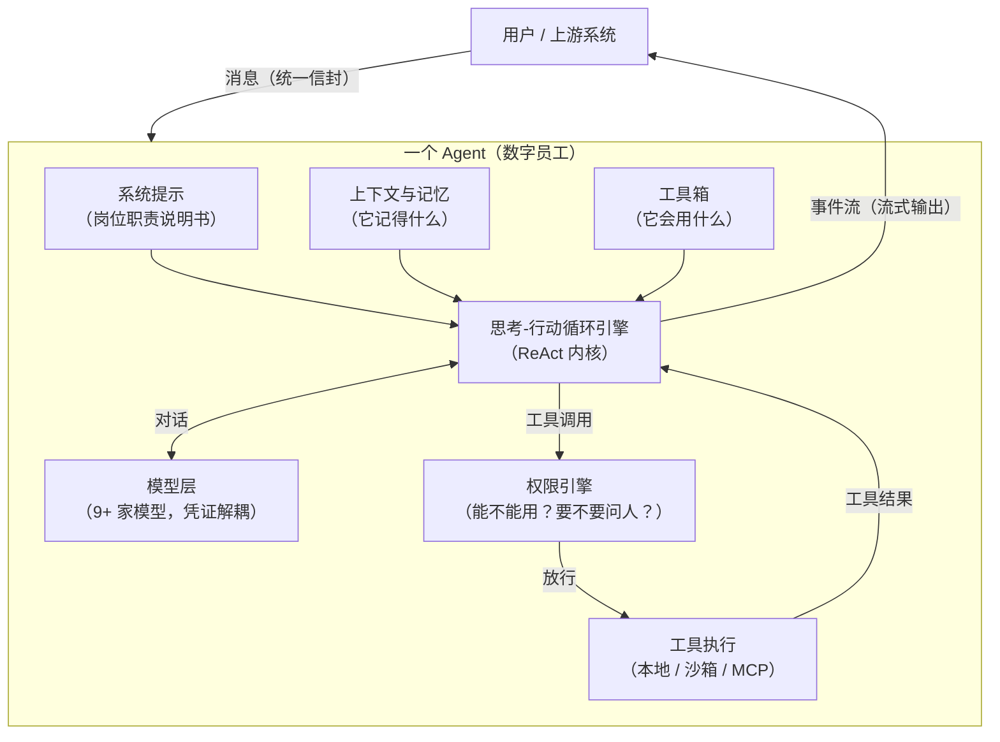

逐个用通俗语言过一遍：

**消息（Msg）**：所有对话内容的统一「信封」，信封里可以装文本、思考过程、图片音视频、工具调用单、工具结果、系统小提示等多种「内容块」。这带来一个重要工程性质：**多模态、工具、思考过程用同一套数据结构表达**，前端渲染、存储、回放只需要理解一种格式。

**模型层**：内置支持 OpenAI、Anthropic、Gemini、DashScope（通义）、DeepSeek、Moonshot、xAI、Ollama 等 9 家对话模型，另有嵌入和语音模型。两个亮点：模型「钥匙」（凭证）与模型类解耦，换供应商不动代码；每家模型有一张 YAML「模型卡」（上下文长度、支持的能力等），供前端动态展示和选择。

**工具箱**：三类来源——①内置工具（读写文件、执行命令、搜索代码、任务清单等，编码场景久经考验）；②MCP 服务器（业界标准协议，接上就有现成工具，如地图、搜索、数据库）；③**技能（Skill）**：注意技能不是可执行工具，而是一份份 Markdown 写的「操作手册」，Agent 用一个内置的「技能查看器」工具按需阅读后，用已有工具照着做——与我们 pi 的技能体系理念完全相同，迁移心智成本低。工具还支持分组按需挂载，运行中可切换，避免工具定义撑爆上下文。

**权限引擎与人工审批**：每个工具调用先过权限检查。策略有四种基本模式（默认询问、只读探索、自动接受编辑、每次都问）。需要人工确认时，Agent 会**暂停等待**，而不是擅自执行：

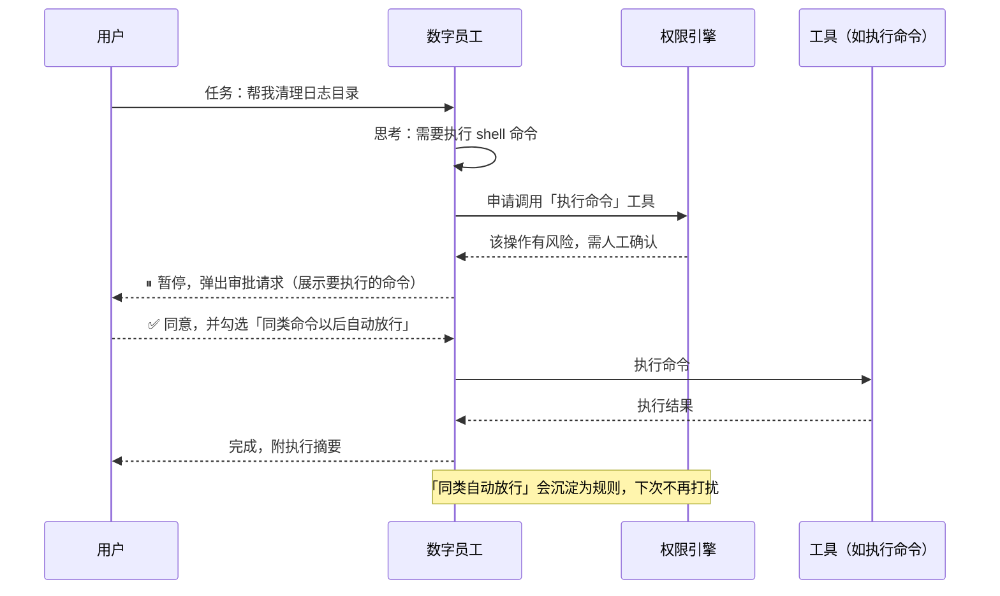

「审批 + 规则沉淀」这套机制是企业级平台的刚需，AgentScope 原生内置，我们自己不用再造。

**状态**：Agent 的记忆上下文、压缩摘要、权限规则、任务清单整体构成「状态」，可以随时存盘、恢复（默认支持 Redis，按「用户-员工-会话」三维寻址）。这等于官方替我们解决了「会话恢复、进程重启不丢脑子」的问题。

**结构化输出**：给一次回复附带数据模板（Pydantic 模型），员工先自由调研、调用工具，最后通过一个内置的「提交结构化结果」工具交卷，校验失败自动重试。做表单、工单、审批流对接时非常有用。

## 6. 上下文工程：长任务的生存之道

数字员工经常一干几小时，上下文窗口却有限。AgentScope 2.0 把上下文管理做成了重头戏，核心是「三明治 + 自动压缩 + 卸载」：

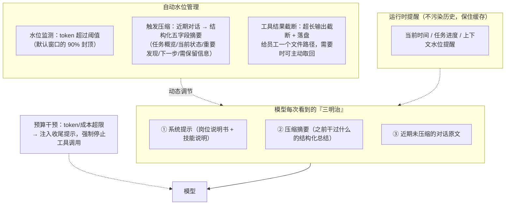

三个设计细节体现了成熟度：压缩摘要是**结构化的**（不是一坨自由文本，信息保真度高）；工具超大输出**落盘卸载**、员工按需取回（而不是粗暴截断丢信息）；运行时提醒以「追加便签」方式注入而不改写历史（保住模型供应商的提示缓存，省钱提速）。

## 7. 从单兵到团队：多智能体协作

2.0 的多智能体思路是「队长制」：一个员工担任队长，通过四个内置工具（建队、派活、喊话、解散）动态组建团队；队员各自有独立会话、并发干活，消息经总线投递；人工审批事件会从队员上抛到队长的会话里统一处理。因为队员是独立会话而非嵌套协程，**天然可分布式部署**。还支持注册「队员模板」（如「只读探索员」「执行员」），队长按任务招聘。

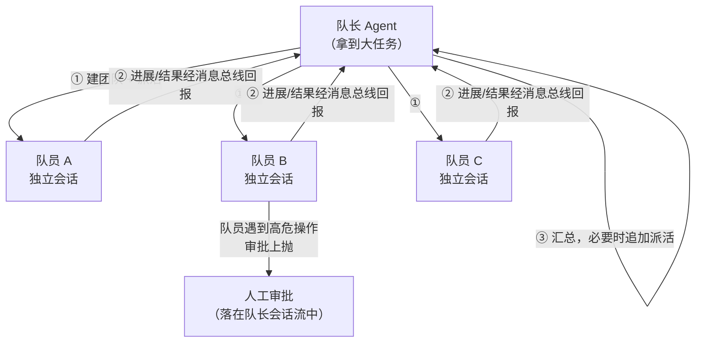

对我们的价值：数字员工平台的「复杂任务编排」不必自研调度框架，用官方团队机制起步，后期按需替换为我们自己的调度器。

## 8. 从框架到生产：Runtime 的故事

「代码能跑」和「能上生产」之间隔着部署、隔离、恢复、扩缩容。AgentScope Runtime 用一年时间回答了这个问题，最终答案并入了 2.0 主框架。它最有价值的遗产是「Agent as API」白盒模式——这个词值得展开，因为它踩过的坑对我们直接适用：

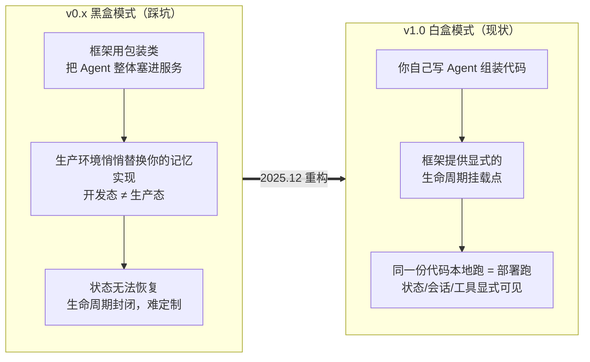

生产化能力清单（现为 2.0 内置）：基于 FastAPI 的执行服务（SSE 流式）、会话与状态持久化、多种部署形态（本地进程 / Docker / K8s / Knative / 函数计算 / 阿里云百炼）、开放协议（A2A 智能体互联 + Nacos 注册中心、OpenAI 兼容接口、AG-UI 前端协议、MCP）。

## 9. 看得见才敢用：可观测与调试

三层工具：**终端控制台**（本地开发，流式输出 + 键盘审批）；**官方 Web UI 示例**（React 参考实现，含团队协作、任务计划、审批、定时任务的完整交互，可作为我们前端的需求参照）；**OpenTelemetry 追踪**（一根中间件挂上，模型调用/工具执行/token 用量全链路 span，零侵入，未配置时零开销）。配合 TypeScript 前端 SDK 的「事件流重建消息」同构 API，断线重连、历史回放有官方路径。

## 10. 记忆、知识与数字员工的大脑

AgentScope 2.0 对记忆的分层非常清醒：**短期记忆不是独立模块，就是会话状态 + 上下文压缩本身**（1.0 的独立记忆模块因与引擎耦合过紧被废除）；**长期记忆做成可插拔中间件**——官方已内置 mem0 集成（提供「搜索记忆 / 写入记忆」两个员工可调用的工具，支持自动检索注入、纯工具化、双模式三种玩法），2026 年又加入 ReMe（文件原生记忆）与 Agentic Memory；**知识库（RAG）** 在 2.0.3 落地：文档解析 → 切块 → 嵌入 → 向量库（Qdrant）→ 知识库句柄，员工侧挂一个 RAG 中间件即可检索，且官方标注支持分布式/多租户/多会话。

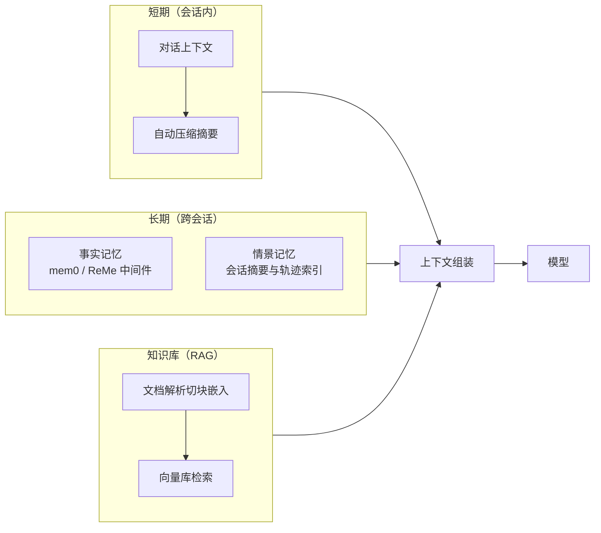

对我们的意义：记忆体系 pi-web 原本就要自建（P1 规划参考 mem0），AgentScope 的中间件形态正好是官方给的「引擎侧接入点」，我们平台级记忆服务可以通过薄中间件接入，两边架构天然咬合。

## 11. 自进化与训练生态

AgentScope 是目前开源框架里**唯一把「训练闭环」当一等公民**的：框架产生轨迹 → 评测打分 → 强化微调，全链路有官方组件。

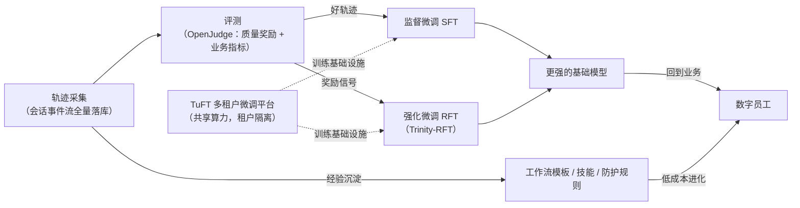

两条进化路线并存：**低成本路线**（把成功经验沉淀为提示词、技能、工作流模板，即「老员工带新员工」）和**高成本路线**（微调模型本身，即「重新招聘培养」）。框架内核已内置训练模块，Java 版甚至有「用真实线上交互数据持续微调」的扩展。相关研究（如自进化智能体综述 arXiv:2508.07407、团队的工作流网络自优化方向）提供了方法论支撑。

## 12. 生态成熟度评估

**优势**：
- 生产级安全三件套齐全（权限审批 + 人工介入 + 沙箱），这在开源框架里少见；
- 全栈闭环：开发→运行→观测→训练，组件间开箱即用；
- 阿里系持续投入，三个月六个版本的迭代速度，中文文档与社区友好；
- 设计哲学与我们现有 pi 底座高度同构（干净内核 + 技能 + MCP + 事件流），迁移心智成本低。

**短板（客观）**：
- **迭代快 = 不稳定**：2.0 对 1.0 完全不兼容，2.x 小版本也在持续加模块，必须管理升级节奏；
- **多租户不完整**：框架内置了多用户/多会话的「请求级」隔离，但**没有租户级鉴权、配额、计费、审计**——这层必须自己建（第二部分的核心工作）；
- **生态重心偏阿里云**：云沙箱、托管部署首选阿里系（无影、百炼、函数计算）；Docker/K8s 开源路径可用，但要自己运维；
- 文档站新旧并存（1.0 文档仍在线），新人文档入口易混淆，需认准 2.0 版本目录；
- 搜索等「外联工具」2.0 起不再内置，统一走 MCP——需要自己准备 MCP 服务器目录。

**结论**：短板全部属于「平台工程层要自己补」的范畴，不属于引擎能力缺陷。与我们「自建平台、只换引擎」的策略正好互补。

## 13. Pi 与 AgentScope：两种底座，两条路线

先摆正比较对象：**pi-web 是一个验证性 demo**——它的价值是证明了「Pi 底座 + Web 控制台」这条路跑得通、并沉淀了控制面的雏形，它不是完成品，本节对比的也不是它，而是两块候选底座本身：**Pi 引擎**与 **AgentScope 框架**。团队的原始设想是以 Pi 为底座做加法、平台能力全部自己写、换取完全可控——这个设想成立，值得和「AgentScope 执行面」路线放在同一张桌上公平比较。

### 13.1 基因对比

| 维度 | Pi | AgentScope 2.0 |
|---|---|---|
| 出身 | 个人编码 Agent 的运行时（TS/Node），小而精 | 通义实验室的通用 Agent 生产框架（Python 为主），企业级投入 |
| 设计哲学 | 干净内核 + 扩展机制，一切透明 | 同样是干净内核 + 中间件，「依赖模型能力而非编排约束」 |
| 目标场景 | 编码助手：单用户、本地优先 | 通用数字员工：多用户、生产部署 |
| 语言栈 | TypeScript 单栈 | Python（另有 TS 前端 SDK、Java 企业版） |
| 社区体量 | 小而美，节奏由小团队决定 | 约 2.9 万 star，三个月六个版本的快速迭代 |

值得强调：**两者内核哲学高度同源**——都是「透明思考-行动循环 + 工具 + 技能（Markdown）+ MCP + 事件流」。这正是当初拿 Pi 做参考、今天能认真讨论两条路线的原因。

### 13.2 能力逐项对比

| 能力 | Pi | AgentScope 2.0 | 对平台建设的影响 |
|---|---|---|---|
| 工具体系 | 编码特化（读/写/编辑/命令/搜索）+ 扩展注册工具 | 通用工具基座 + 工具分组按需挂载 + MCP 原生客户端 | 非编码类数字员工（运营/客服/分析）AS 起点更高 |
| 扩展机制 | 生命周期钩子 + 注册工具 + 自定义条目 | 六钩子中间件（洋葱模型） | 旗鼓相当，都是非侵入式 |
| 人工审批 | RPC 模式可向 UI 抛审批请求 | 权限五模式 + 暂停等待 + 放行规则自动沉淀 | 企业级审批策略 AS 开箱 |
| 沙箱 | 宿主进程直跑，路径校验兜底 | Docker/gVisor/轻量VM/云沙箱/K8s 多后端 | 多租户刚需，AS 白送 |
| 上下文管理 | 自动压缩 + 会话 JSONL | 结构化五字段压缩 + 大结果卸载 + 运行时注入 + token 预算干预 | 长任务稳定性 AS 明显更厚 |
| 记忆 | 无内置（平台层本来就要自建） | mem0/ReMe 中间件 + RAG 模块 | 平台层两条路线都要建服务（见 §2.1） |
| 多智能体 | 靠扩展（子代理/工作流） | 队长制团队、独立会话并发、可分布式 | 复杂任务编排 AS 有官方答案 |
| 状态与多用户 | 单用户设计，配置写全局目录 | 状态持久化 + 用户/会话级请求隔离 | 多租户执行层 AS 有地基（见 §9.1） |
| 可观测 | 事件流 | OTel 追踪 + Web UI 参考实现 + 终端控制台 | 排障与看板 AS 组件更全 |
| 自进化/训练 | 无 | 轨迹 → 评测 → 微调闭环 | 数字员工的长期卖点，AS 独有 |
| 演进风险 | 上游小团队，变更温和但功能增长慢 | 上游激进，能力强但破坏性变更频繁 | A 慢而稳，B 快而颠 |

### 13.3 以谁为底座，本质是决定「执行面自研范围」

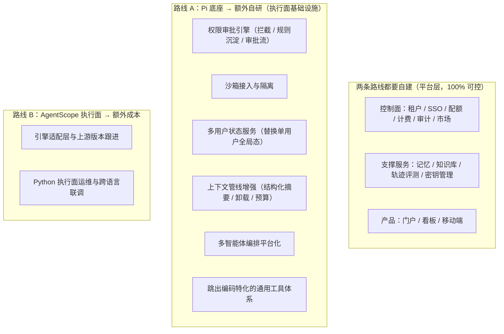

一句话：**路线 A 的额外工作量，约等于在 TS 里把 AgentScope 2.0 的基础设施层（权限、沙箱、状态、上下文、团队）重写一遍**——量级在专人一年以上，且安全能力要自己向客户证明；路线 B 把这一层白盒采用，代价是引入 Python 执行面和跟随上游节奏。而平台层（控制面 + 支撑服务 + 产品）**无论选哪条路线都得自己建，也都是自己 100% 可控的**。

### 13.4 「可控性」辨析与选择建议

关键认知：**开源 ≠ 可控；可控 = 能锁定版本、能 fork、能替换**。逐层拆解「所有东西自己可控」这句话：

- **平台层**（控制面 + 支撑服务）：占平台代码量大头，两条路线下都是自己写——「可控」的主要部分其实与底座选择无关；
- **底座层**：Pi 和 AgentScope 都是第三方开源项目，严格说都不是我们的代码。区别在 Pi **薄**（没有别人的复杂度要背，但也没有别人的积累可用），AgentScope **厚**（白盒设计 + Apache-2.0 可 fork + 可锁版本，但要背上游演进节奏）；
- **真正的分歧**只在执行面基础设施：自己写（A：代码级可控，但工作量和安全证明成本高）还是白盒采用（B：工作量小，但要做依赖管理）。

| 如果…… | 更适合 |
|---|---|
| 团队强 TS 弱 Python，且能接受较长的基础设施自建周期 | 路线 A，按 §13.3 清单排期 |
| 平台要尽快上生产、要过安全合规、要承接多租户客户 | 路线 B（本方案默认） |
| 想兼得：执行面抢时间 + 保留换底座的自由 | 路线 B + 引擎适配层（即本方案的设计） |

本方案其余部分按路线 B 展开；路线 A 的工作量清单保留在 §13.3 作对照，且第二部分的平台层设计对两条路线完全通用。

---

# 第二部分 平台适配落地方案

## 0. TL;DR

1. **架构**：三层平台——控制面（自研网关：门户/租户/审批/市场/审计计费）+ 执行面（AgentScope 执行服务：引擎/工具/沙箱/状态）+ 支撑面（自建服务：模型网关/记忆/知识库/轨迹与评测/沙箱池）。注意「自建」= 在官方零件之上做服务化封装，**不是重造零件**，详见 §2.1。
2. **底座选型**：pi-web 仅为验证性 demo，不构成选型束缚；「Pi 底座 + 厚自研」与「AgentScope 执行面 + 自研控制面」两条路线的全面对比见 §1.13。本方案默认后者，并以引擎适配层保留随时回退的自由。
3. **迁移**：不推倒重来。前端保留三栏控制台改事件映射；网关保留升级为多租户控制面；把「每会话一个 pi 子进程」替换为「AgentScope 执行服务」，引擎调用从本机子进程 JSONL 改为 HTTP/SSE。
4. **四大模块**：工具管理（统一工具目录 + 审批策略引擎）、上下文管理（组装管线 + token 预算 + 压缩卸载）、长短期记忆（四层记忆 + 平台级记忆服务，引擎侧薄中间件）、自进化（轨迹→评测→经验沉淀→灰度→微调，分层推进）。
5. **多租户**：框架自带的「多用户」只覆盖执行层隔离，组织/SSO/配额/计费/审计这层控制面自建（分工见 §9.1）；网关层承担租户身份/隔离/配额/计费，执行面与沙箱按租户标签路由。
6. **沙箱**：**结论是需要接入，但分级接入**——容器池化为默认档，强隔离（gVisor/轻量 VM）为高合规档，云沙箱为弹性档；纯对话/API 型员工允许免沙箱。论证见第 10 节。

## 1. 现状盘点与迁移原则

先说明定位：**pi-web 是验证性 demo**（证明「Pi 底座 + Web 控制台」路线可行），不是完成品；下文所谓「资产」指 demo 验证过的方向与可复用雏形，整个方案面向「从 demo 进化到成熟平台」，而非在 demo 上修补。demo 现状：React 三栏前端 + Fastify 网关（SQLite 元数据）+ **每会话一个 pi RPC 子进程**（stdio JSONL 桥），已跑通 MCP 桥、技能广场、工作区文件树、产物追踪；同时暴露了明确短板：单用户设计、无 OS 级隔离、无跨会话记忆（P1 规划中）、密钥与配置写全局目录。

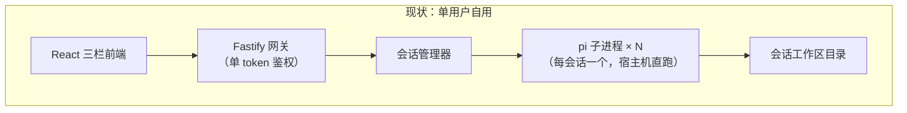

迁移原则（四条，来自我们已有的架构决策传统）：

1. **引擎可插拔**：网关只见「引擎适配接口」，不感知底层是 pi 还是 AgentScope——为未来保留退出通道；
2. **平台服务引擎无关**：记忆、工具目录、知识库做成独立服务，任何引擎都能消费（防止被框架演进锁死）；
3. **事件模型先行**：前后端之间只认统一事件流，引擎差异被隔离在适配层；
4. **面向多租户重造控制面，不为单用户现状妥协**。

**现有资产去向映射**：

| 现有资产 | 去向 | 改造量 |
|---|---|---|
| React 三栏前端 | 保留布局，事件模型改为 AgentScope 事件流映射；新增审批弹层 | 中 |
| Fastify 网关 + REST/WS | 保留骨架，升级为多租户控制面（SSO/租户/配额/审计） | 中 |
| 会话管理器 | 重写为「执行面调度器」：管理 AgentScope 会话生命周期 | 重写 |
| 子进程 JSONL 桥 | 替换为 SSE 事件流客户端（断线重放有官方机制） | 重写 |
| MCP 桥（配置生成） | 改为平台「MCP 服务器目录」+ 租户授权，接入交给引擎原生 MCP 客户端 | 小 |
| 技能广场 | 升级为「技能 + 工具 + MCP」统一市场 | 小 |
| 工作区/产物追踪 | 概念平移到 AgentScope 工作区（本地目录或沙箱内） | 小 |
| SQLite 元数据 | 演进为 PostgreSQL（行级租户隔离）+ Redis（状态/总线） | 中 |
| 全局用户配置目录 | 租户级配置库 + 密钥库（BYOK） | 重设计 |

## 2. 目标架构：三层平台

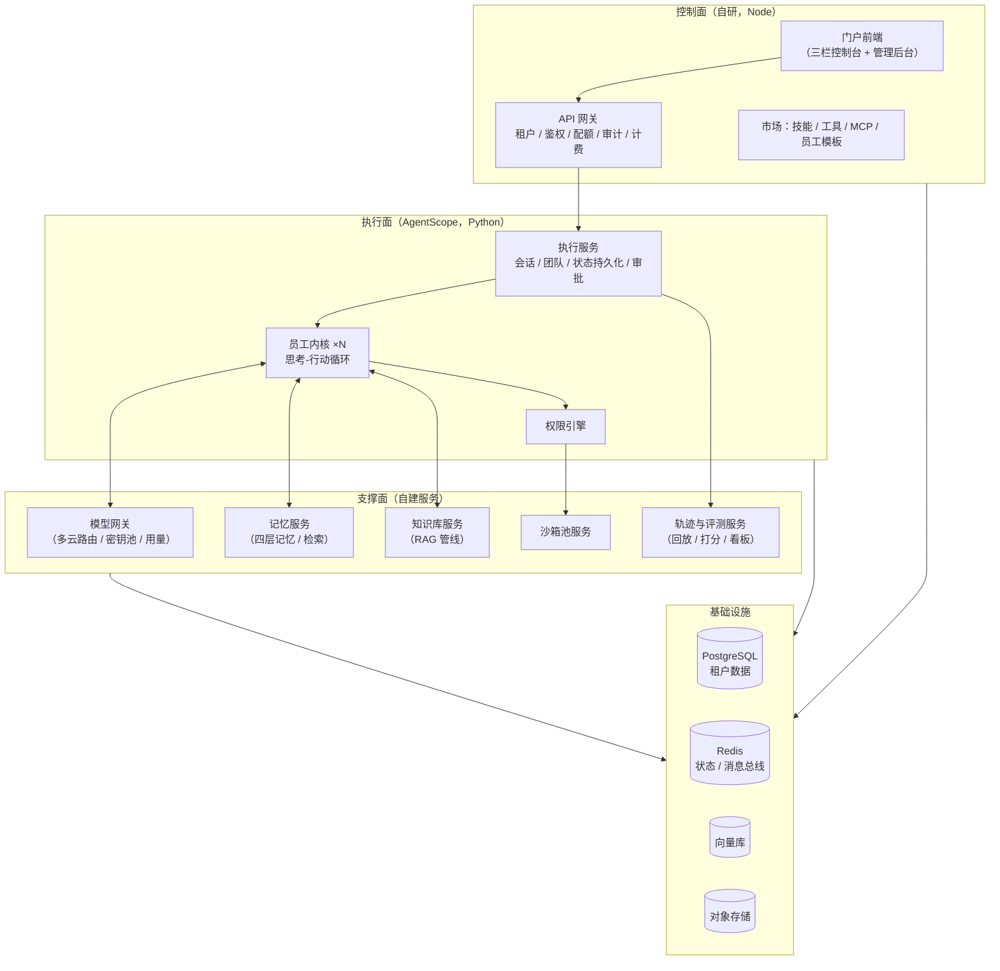

**职责边界（关键决策及理由）**：

| 决策 | 选择 | 理由 |
|---|---|---|
| 执行服务：自研 or 用官方？ | **用官方 AgentScope 执行服务扩展** | 官方已提供会话/团队/状态/预算/多用户，重造无价值；白盒模式允许我们插入自己的组装逻辑 |
| 控制面：自研 or 用官方？ | **自研** | 官方明确不含租户鉴权/配额/计费/审计；这层是平台的核心资产，必须自有 |
| 记忆/知识库：引擎内置 or 独立服务？ | **独立服务 + 引擎侧薄中间件** | 引擎无关、多引擎共享、避免被 mem0/ReMe 的官方演进方向绑死（延续我们既有架构决策） |
| 模型接入：直连 or 模型网关？ | **平台模型网关** | 多租户 BYOK、配额、路由、脱敏审计统一收口；引擎的凭证层对接网关即可 |
| 控制面语言：改 Python？ | **保持 Node** | 跨语言只靠 HTTP/SSE 协议，不共享代码；保留现有前端/网关资产与团队技能 |

### 2.1 厘清关键问题：官方「自带」的和我们「自建」的是什么关系

第一部分介绍过官方自带 RAG 模块、记忆中间件、沙箱后端、OTel 追踪……而上面又说支撑面要「自建」，看似矛盾，其实是**零件与整车**的关系：

- **官方给的是零件**：以 Python 库/组件的形态存在于引擎进程内，解决「单次会话内怎么干」——RAG 模块负责解析切块嵌入检索、沙箱后端负责隔离执行、追踪中间件负责埋点；
- **平台要的是整车**：独立部署的服务，解决「成百上千个租户、成千上万个员工长期运营」——多租户隔离与配额、数据归属与治理、产品界面、运维监控、计费出账。

| 能力 | 官方零件（直接复用） | 平台整车（自己建造） | 自建的第二个理由 |
|---|---|---|---|
| 模型接入 | 9+ 家模型适配 + 凭证解耦 | 模型网关：多租户密钥池/BYOK、用量归集、路由降级 | 密钥安全与计费必须平台掌握（初期可执行面直连 + 控制面管密钥，规模化再独立成网关） |
| 记忆 | mem0/ReMe 中间件（引擎侧钩子） | 记忆服务：租户隔离、治理界面、导入导出 | 跨引擎共享、防框架锁死（延续既有架构决策） |
| 知识库 | RAG 模块（解析/切块/嵌入/向量库句柄） | 知识库服务：上传管理、解析调度、权限、配额 | 同上 |
| 轨迹与评测 | 事件流格式 + OTel 中间件 + OpenJudge | 轨迹库、租户/员工维度看板、评测流水线 | 轨迹数据是平台资产，必须归平台 |
| 沙箱 | Docker/gVisor/轻量VM 等隔离后端 | 沙箱池：预热、租户路由、回收、计费 | 调度与运营是平台自己的 know-how |

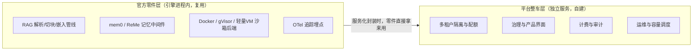

所以准确的表述是：**隔离技术、解析管线、埋点协议这些「技术难度高的零件」复用官方；服务化、多租户化、产品化这些「平台难度高的整车」自己造**。官方自己也把这个边界画得很清楚——框架不做控制面（租户、计费、SSO），这正是我们平台的价值空间，也是「自建」二字的真实含义：建服务，不是造零件。

## 3. 端到端链路：一次对话在新平台怎么跑

以「租户 A 的员工 E 执行数据清理任务」为例：

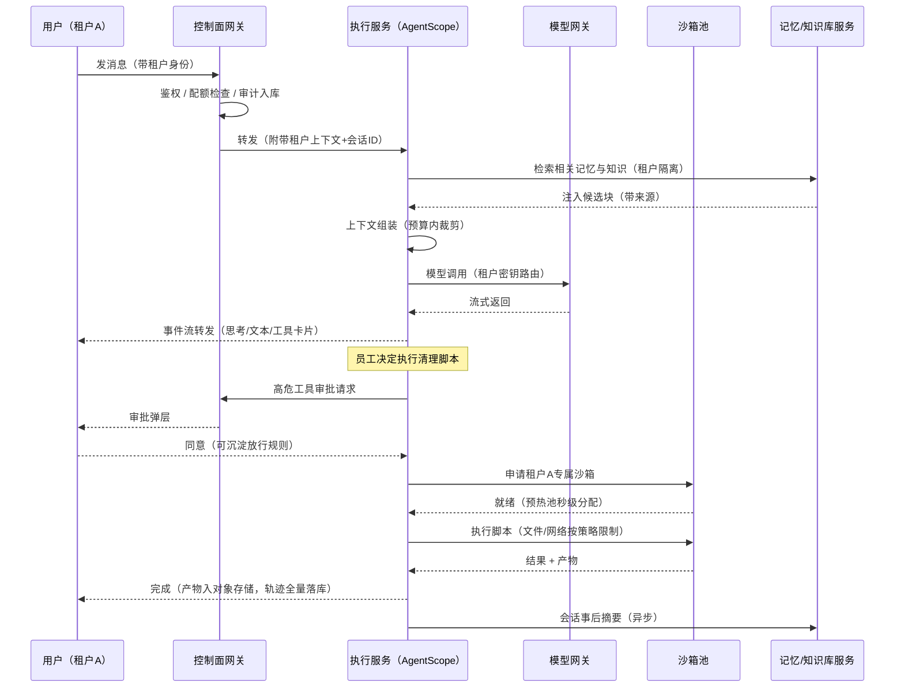

这条链路就是平台的「主循环」，后面所有模块设计都挂在它的环节上。

## 4. 迁移路径与阶段计划

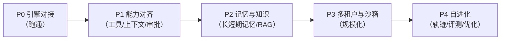

| 阶段 | 目标 | 关键交付 | 验收标准 |
|---|---|---|---|
| P0 | 换引擎不换体验 | 执行面跑通 AgentScope；事件流映射；前端零大改完成对话/工具卡片/中断 | 现有三栏控制台完成一轮含工具调用的任务 |
| P1 | 平台基础能力 | 工具目录 v1（内置+MCP）、审批 UI、上下文组装管线 v1、模型网关 | 多模型切换、MCP 工具接入、审批放行规则生效 |
| P2 | 有记性的员工 | 记忆服务（四层）、RAG 管线、会话自动摘要 | 跨会话记忆用例：会话A记住→会话B自动召回 |
| P3 | 多租户规模化 | 租户体系、配额计费、沙箱池 L1→L2、审计 | 两租户互不可见；高危操作全程隔离与留痕 |
| P4 | 越用越强 | 轨迹回放与评测看板、经验库、提示词/技能自动优化建议；微调试点 | 评测驱动的员工版本灰度发布流程跑通 |

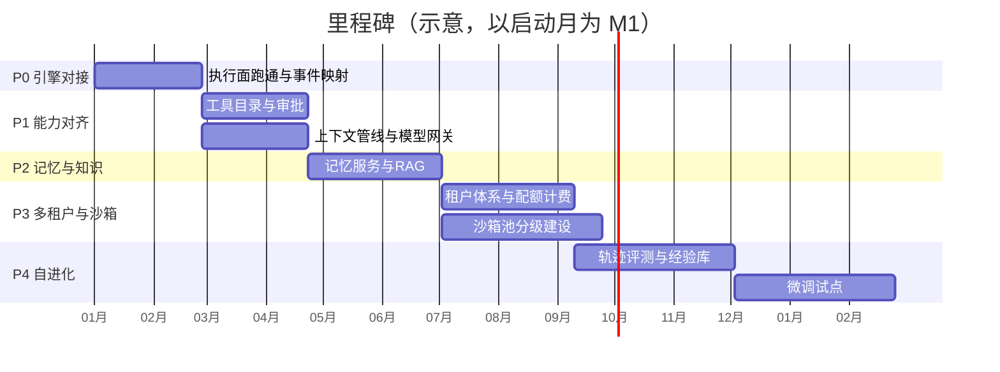

**退出通道**：引擎适配接口（启停/发消息/收事件/取产物五件事）贯穿始终。若 AgentScope 演进不符合预期，实现一个新引擎适配（哪怕回到 pi 或换其他框架）控制面与前端不动。这是整个迁移的风险保险丝。

## 5. 工具管理：从「能用工具」到「工具是资产」

### 5.1 统一工具目录

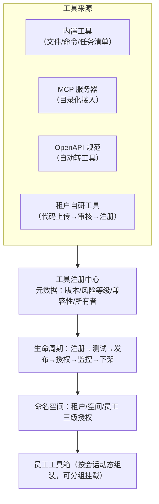

设计要点：
- **风险分级**是审批策略的输入：只读（查询类）/ 写入（文件、数据库）/ 执行（命令、代码）/ 外发（发消息、调外部 API）四级；
- **测试即上线门槛**：每个工具注册时跑一组标准用例（含越权用例：跨租户访问必须失败）；
- **用量监控**：调用频次、失败率、平均耗时、token 消耗，反哺市场推荐与下架决策；
- MCP 服务器目录借鉴官方 MCP & Skill Hub 思路，支持一键接入 + 租户级授权审批。

### 5.2 审批策略引擎

策略 = 工具风险等级 × 租户策略 × 员工岗位配置，四档结果：自动放行 / 首次审批 / 每次审批 / 禁止。审批动作沉淀「放行规则」（如「该员工对该目录的读操作免审」），规则可查看、可撤销——这套机制 AgentScope 权限引擎原生支持，我们做的是把策略配置产品化到控制台。

## 6. 上下文管理：每一 token 都花在刀刃上

上下文组装做成**管线**，每个环节独立可测、可按员工类型重排：

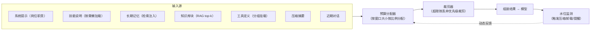

**token 预算分配示例（128k 窗口）**：

| 组成部分 | 占比 | 超限策略（丢弃优先级从高到低） |
|---|---|---|
| 系统提示 + 技能 | 5% | 技能懒加载（用到才注入） |
| 长期记忆 | 5% | 降 top-k，保最近最相关 |
| RAG 检索块 | 10% | 降 top-k，附来源可回查 |
| 工具定义 | 5% | 工具分组切换 |
| 压缩摘要 | 15% | 二次压缩 |
| 近期对话 | 55% | 触发结构化压缩（保任务连续性） |
| 输出预留 | 5% | 硬保留 |

工程细节沿用引擎既有能力：结构化五字段摘要、工具大结果落盘卸载 + 主动取回、运行时便签注入（时间/任务进度/水位提醒，不污染历史以保缓存）。平台自研的部分是**预算分配器的产品化配置**（不同员工类型不同配比）与**检索质量的评测**。

## 7. 长短期记忆：给员工一颗大脑

### 7.1 四层记忆模型

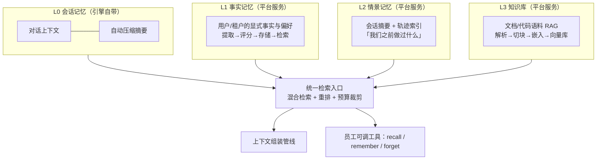

### 7.2 读写链路

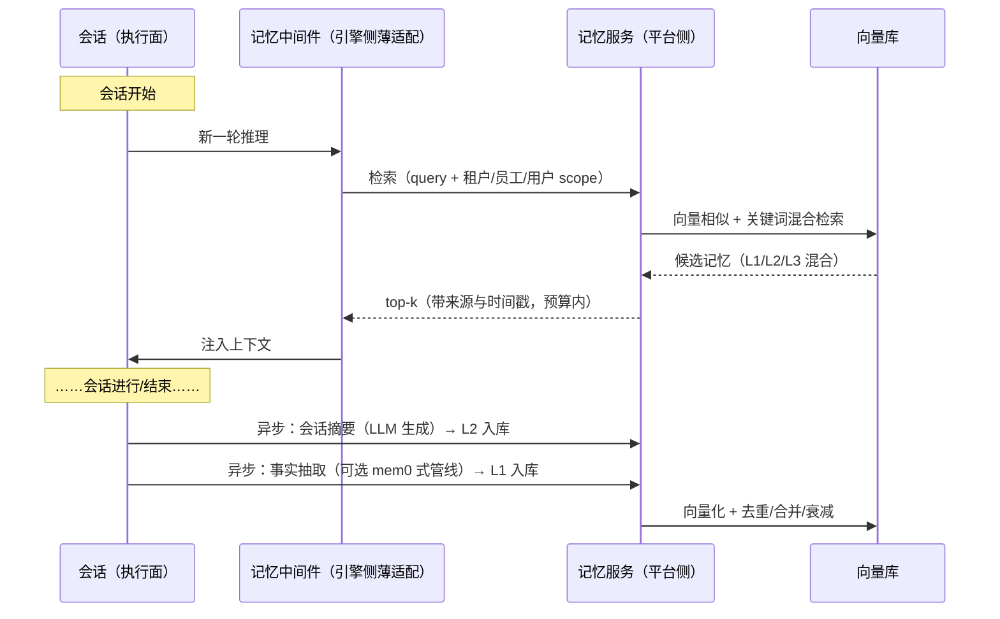

### 7.3 关键决策

- **记忆服务独立于引擎**（延续既有决策）：引擎侧只挂一个薄中间件（对接 mem0 或自研），官方 ReMe 作为备选后端——即使官方记忆生态继续演进，我们的数据与服务不动；
- **治理配套**：记忆带来源与时间戳、租户内按 scope 隔离、控制台提供查看/删除/导出（合规刚需：用户有权遗忘）；
- **向量库选型**：起步用 PostgreSQL 向量扩展（单库少运维），规模后迁移专用向量库（引擎 RAG 模块默认对接 Qdrant，可平滑）；
- **记忆污染防护**：写入走评分管线（重要性/时效性），检索结果标注来源，员工引用记忆时可见可溯。

## 8. Agent 自进化：从「能用」到「越用越好」

自进化不是一个开关，是一条**分四档逐步加深**的流水线：

```mermaid
flowchart LR
    subgraph COLLECT["① 采集（P4a）"]
        T1["轨迹全量落库<br/>（事件流=行车记录仪）"]
    end
    subgraph EVAL["② 评测（P4a）"]
        E1["业务指标：成功率/成本/时长/人工介入率"]
        E2["质量评审：规则 + LLM 裁判（OpenJudge 式）"]
    end
    subgraph DISTILL["③ 经验沉淀（P4b）"]
        D1["成功轨迹 → 工作流模板/技能候选"]
        D2["失败轨迹 → 防护规则/审批策略收紧"]
        D3["高频模式 → 提示词优化建议"]
    end
    subgraph OPT["④ 优化分发"]
        O1["经验级：提示词/技能/模板更新<br/>（快、低风险、人工审核后生效）"]
        O2["模型级：SFT/RFT 微调<br/>（慢、高成本，Trinity-RFT/TuFT）"]
    end
    COLLECT --> EVAL --> DISTILL --> OPT
    O1 & O2 --> SHIP["版本化发布：影子运行→小流量→全量→可回滚"]
    SHIP -.->|"效果回流，闭环"| COLLECT
```

落地策略：
- **P4a 只做采集与评测**：先把「行车记录仪」和「 scoreboard」建起来，这是所有进化的地基，且立即有运营价值（员工质量看板、坏例回放）；
- **P4b 经验级进化**：全部人工审核后灰度——进化速度受控、风险可控，不迷信全自动；
- **P4c 模型级微调（可选）**：仅当某类员工任务量大、提示词优化到顶、且我们掌握可微调基座时启动；多租户共享算力训练直接对标官方 TuFT 的产品形态；
- **安全阀**：任何「自进化」产出的变更（提示词/技能/模型）都走平台统一的版本管理与灰度发布，禁止直连生产。

## 9. 多租户：平台的地基

### 9.1 先澄清：框架的「多用户」≠ 平台的「多租户」

AgentScope 2.0 确实在执行层内建了多用户支持（这也是它相对多数框架的卖点），但含义要厘清——它给的是地基，不是整栋楼：

| 层 | 具体能力 | 谁提供 |
|---|---|---|
| 执行层（框架已覆盖） | 请求携带用户/会话标识；状态按「用户-员工-会话」寻址互不串台；按会话的 token/成本预算控制；调用量统计 | AgentScope ✅ |
| 控制层（必须自建） | 租户=组织（开通/成员/角色/空间）；SSO 登录与鉴权；套餐与配额策略；计费出账；审计报表；数据隔离的实施落地 | 我们 ❌ |

打个比方：框架的多用户像**操作系统的多用户**（多个账号互不干扰地共用一台机器）；平台要的租户是 **SaaS 公司的客户**（注册签约、套餐账单、数据主权、合规审计）。前者是后者的地基，但离「能卖给客户」还差整个控制面。另外，AgentScope Java 2.0 宣传了框架级多租户隔离，但那是 JVM 线产品；且即便在 Java 版里，SSO/计费/组织管理这类 SaaS 控制面同样不在框架范围内。

因此本方案的多租户分工是：**框架负责执行层的用户/会话隔离与预算控制（白送），我们负责组织/身份/配额/计费/审计整层控制面（自建，也是平台的核心资产所在）**。

### 9.2 租户模型与隔离矩阵

```mermaid
flowchart TB
    PLAT["平台"] --> ORG["组织（租户）"]
    ORG --> WS["空间/项目"]
    WS --> EMP["数字员工（岗位模板实例）"]
    EMP --> CONV["会话（可恢复的状态）"]
```

| 隔离维度 | 机制 | 实施层 |
|---|---|---|
| 身份 | SSO/OIDC 登录，JWT 携带租户/空间/角色 | 控制面 |
| 数据 | PostgreSQL 行级安全 + 对象存储租户前缀 + 向量库按 scope 过滤 | 支撑面 |
| 密钥 | 平台密钥池 + 租户 BYOK（仅本租户路由可用，永不下发到前端） | 模型网关 |
| 配额 | 会话并发 / token 日月额度 / 沙箱数 / 存储空间，超限熔断 | 控制面 |
| 工具与 MCP | 租户授权范围，跨租户默认不可见 | 工具目录 |
| 网络 | 员工出网白名单按租户配置（防数据外泄） | 沙箱/执行面 |
| 审计 | 全操作留痕：谁、何时、让哪个员工、干了什么、花了多少 | 控制面 |
| 计费 | token 用量（事件自带）+ 沙箱时长 + 存储三要素 | 控制面 |

### 9.3 租户上下文的传递

网关签发的租户上下文（组织/空间/员工/会话四元组）随请求注入执行面，执行面将其转化为：状态存储的寻址维度（引擎原生支持「用户-员工-会话」三维，组织维度由网关映射）、记忆/知识检索的过滤条件、沙箱的租户标签与出网策略。**执行面无租户明文密钥**——所有模型调用经模型网关代签。

## 10. 沙箱：要不要接、怎么接（重点论证）

### 10.1 为什么必须认真回答这个问题

数字员工与「聊天机器人」的本质区别是**会动手**：执行脚本、处理文件、操作浏览器、调用外部系统。动手能力放多大，爆炸半径就有多大。同时我们已明确要做**多租户**——「邻居风险」（一个租户的员工碰到另一个租户的数据）和「宿主风险」（员工进程读到平台密钥、环境变量、宿主文件系统）在单用户时代可以靠部署边界糊弄，多租户时代是合规红线。现有 pi-web 的 README 已自我警示：子进程在宿主机直跑、无 OS 级隔离——这个问题在切换引擎时**正好是一并解决的窗口期**。

### 10.2 需求驱动：哪些动作需要隔离

| 员工动作 | 风险 | 是否需要沙箱 |
|---|---|---|
| 对话、写文案、结构化抽取 | 低（纯模型调用） | 不需要 |
| 调用受审批的 SaaS API（只读） | 低 | 不需要（API 层鉴权足够） |
| 执行用户提供的代码/脚本 | 高（任意代码） | **必须** |
| 读写工作区文件 | 中 | 建议工作区即沙箱内目录 |
| 浏览器自动化（网页操作） | 中高（外发、凭据） | 建议浏览器跑在沙箱内 |
| 处理租户上传的文档 | 中（恶意文件） | 建议 |

结论：**不是所有员工都需要沙箱，但平台必须具备沙箱能力**，并按风险路由。

### 10.3 候选方案对比

| 方案 | 隔离强度 | 冷启动 | 成本密度 | 运维复杂度 | 说明 |
|---|---|---|---|---|---|
| 进程内限制（无沙箱） | 弱 | 无 | 最高 | 低 | 仅靠权限审批兜底，多租户下不可接受为默认 |
| Docker 容器 | 中（共享内核） | 秒级，池化后近实时 | 高 | 中 | 性价比默认档 |
| gVisor（用户态内核） | 强 | 秒级 | 中高 | 中高 | 拦截系统调用，容器逃逸面大幅缩小 |
| 轻量 VM（boxlite / Firecracker 类） | 极强（硬件级） | 秒~十秒级 | 中 | 高 | 官方 boxlite 标注「近零逃逸」；Firecracker 在官方路线图 |
| K8s Pod 级 | 强 | 分钟级（需预热） | 中 | 高（需 K8s 团队） | 企业部署形态本身，与容器池并用 |
| 云沙箱（无影 AgentBay / E2B / Daytona / Modal） | 强 | 快（厂商池化） | 按量付费 | 低（托管） | 弹性峰值、GUI/浏览器/移动自动化场景 |

### 10.4 取舍论证

**接入的代价**（诚实列出）：冷启动延迟（容器秒级，任务型员工可接受，实时对话型需预热池）；资源成本（每会话一容器密度低，需空闲回收 + 会话休眠）；运维复杂度（镜像构建分发、节点监控、容量规划）；工程量（池化调度、生命周期管理）。

**不接入的代价**：平台能力上限被锁死在「纯 API 型员工」，做不了代码执行/文件处理/浏览器自动化——这恰是数字员工的核心卖点；多租户合规无法对客户交代（「我们的隔离手段是权限提示词」不构成安全承诺）；一旦发生宿主密钥泄露或跨租户读写，是平台级事故。**两害相权：接入的成本是工程量（可控、一次性），不接入的成本是产品上限与安全底线（不可接受）。**

**为什么分级而不是一步到顶**：强隔离（轻量 VM）成本高、启动慢，给所有员工上 microVM 是浪费；纯对话员工上容器也是浪费。正确姿势是**按「员工类型 × 工具风险 × 租户合规等级」路由**：

```mermaid
flowchart TB
    Q{"新会话/新工具调用"}
    Q -->|"纯对话 / 只读API"| L0["L0 免沙箱<br/>进程内执行"]
    Q -->|"代码执行 / 文件处理"| L1["L1 容器沙箱（默认档）<br/>预热池 + 会话休眠"]
    Q -->|"浏览器自动化 / 外发敏感"| L2["L2 强隔离<br/>gVisor / 轻量VM"]
    Q -->|"高合规租户 / 外部代码"| L2X["L2+ 独立Pod / 专属节点"]
    Q -->|"弹性峰值 / GUI / 移动端"| L3["L3 云沙箱<br/>按量付费"]
```

### 10.5 沙箱池生命周期（L1 默认档的实现）

```mermaid
sequenceDiagram
    participant SVC as 执行服务
    participant POOL as 沙箱池服务
    participant SBX as 沙箱实例
    participant MON as 监控

    Note over POOL: 常态：按租户画像预热<br/>（镜像分层共享，秒级扩容）
    SVC->>POOL: 申请（租户标签 + 风险等级 + 资源规格）
    POOL-->>SVC: 从预热池分配（近实时）
    SVC->>SBX: 注入最小化环境（工作区挂载/出网策略）
    loop 会话期间
        SVC->>SBX: 工具执行（命令/文件/浏览器）
        SBX-->>SVC: 结果 + 产物流
        MON->>MON: 心跳与资源监控
    end
    Note over MON: 空闲超时 → 休眠（状态外置，秒级唤醒）
    MON->>POOL: 闲置回收（工作区快照入对象存储）
    POOL->>POOL: 销毁实例，回补预热池
```

关键工程点：状态外置（会话状态在 Redis/DB，沙箱可随时销毁重建——引擎的状态持久化正好支撑这一点）；镜像分层（基础镜像 + 租户工具层，冷启动摊薄）；心跳回收与实例配额防资源泄漏；沙箱内可跑 MCP 服务器（官方已支持），租户专属工具的密钥只进沙箱不进平台。

**结论**：接入，分四级路由，L1 容器池起步（P3），L2/L3 按客户与场景按需启用；沙箱层用引擎自带的多种后端与工作区抽象，平台自建的是「池化调度与租户路由」，不重复造隔离技术。

## 11. 风险与应对

| 风险 | 影响 | 应对 |
|---|---|---|
| 框架快速迭代（2.0.0→2.0.6 仅三个月，含破坏性变更） | 升级可能破坏执行面 | 锁小版本；执行面收敛在适配层；专人跟踪 release notes；灰度升级 |
| 生态重心偏阿里云 | 托管能力绑定 | 坚持 Docker/K8s 开源路径；模型多云经网关；沙箱后端保持可替换 |
| 文档新旧并存（1.0 文档仍在线） | 踩坑、误用旧 API | 团队规范：只认 2.0 版本目录；建立内部踩坑库 |
| 自建记忆/知识服务与官方演进重叠（ReMe 等） | 重复建设 | 记忆服务引擎无关设计，官方组件作为可替换后端而非地基 |
| Node 控制面 + Python 执行面跨语言 | 联调与排错成本 | 只靠 HTTP/SSE 协议集成，契约先行（事件模型 schema 化）；不共享代码 |
| 沙箱运维复杂度 | 平台稳定性 | 池化 + 自动回收 + 容量告警；L3 云沙箱兜底弹性 |
| 自进化失控 | 质量回退、安全问题 | 一切变更走版本化灰度 + 人工审核；评测不通过自动回滚 |

## 12. 结语

Pi 教给我们的核心经验是：**干净的内核 + 外围生态**才能长久。AgentScope 2.0 恰好是同一哲学在 Python 生态的当前最优解，且把生产化的三座大山（安全审批、沙箱、状态持久化）都替我们搬掉了。我们的价值不在于再造引擎，而在于建引擎之上的**平台**：租户体系、工具市场、记忆大脑、进化流水线。迁移不是推倒重来，是把「单用户自用的好底座」升级为「多租户共用的好平台」。若团队最终选择路线 A（Pi 底座 + 厚自研），§13.3 的清单就是路线图——第二部分的平台层设计对两条路线完全通用，选择权始终保留在我们自己手里的引擎适配层上。

---

## 附录：主要资料来源（检索于 2026-08-18）

- AgentScope 官方文档（2.0.x）：docs.agentscope.io/versions/2.0.3/en（含 FAQ、Release Notes、Changelog）
- AgentScope GitHub：github.com/agentscope-ai/agentscope（README、docs/roadmap.md）
- PyPI：pypi.org/project/agentscope/（版本时间线，最新 2.0.6，2026-08-07）
- AgentScope Runtime（已归档）：github.com/agentscope-ai/agentscope-runtime、runtime.agentscope.io（intro / concept / sandbox / protocol / CHANGELOG）
- 官网生态地图：agentscope.io（ReMe、OpenJudge、Trinity-RFT、TuFT、skills、QwenPaw）
- TuFT：github.com/agentscope-ai/TuFT、agentscope-ai.github.io/TuFT
- Trinity-RFT：github.com/agentscope-ai/Trinity-RFT
- QwenPaw（前身 CoPaw）：github.com/agentscope-ai/QwenPaw、qwenpaw.agentscope.io
- AgentScope Platform：platform.agentscope.io
- AgentScope Java：java.agentscope.io（v2 分布式多租户、在线训练扩展）
- 论文：AgentScope（arXiv:2402.14034）、AgentScope 1.0（arXiv:2508.16279）、自进化智能体综述（arXiv:2508.07407）
- 内部资料：docs/backend-decision.md（记忆层独立、引擎不叠加的既有决策）、README.md（pi-web 现状）
