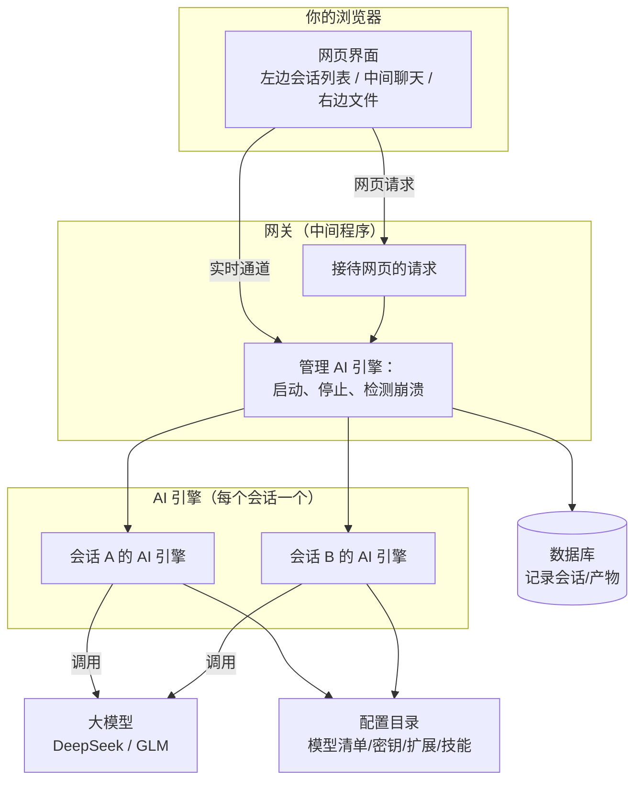
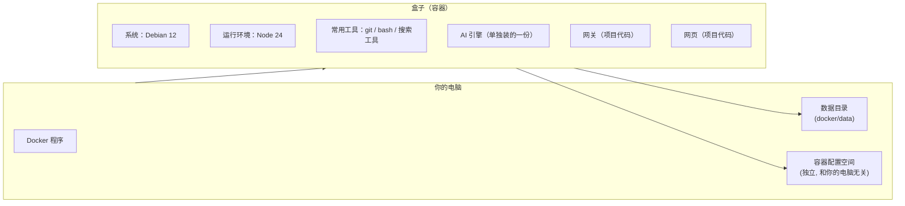
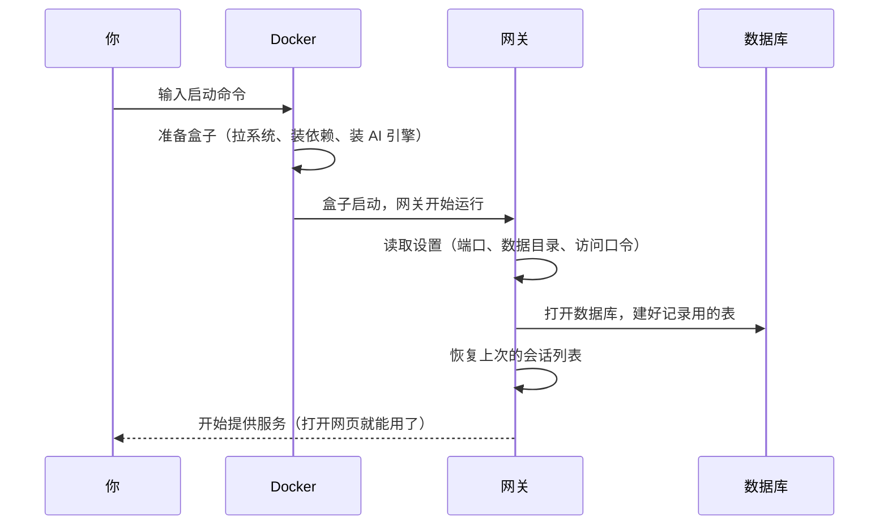
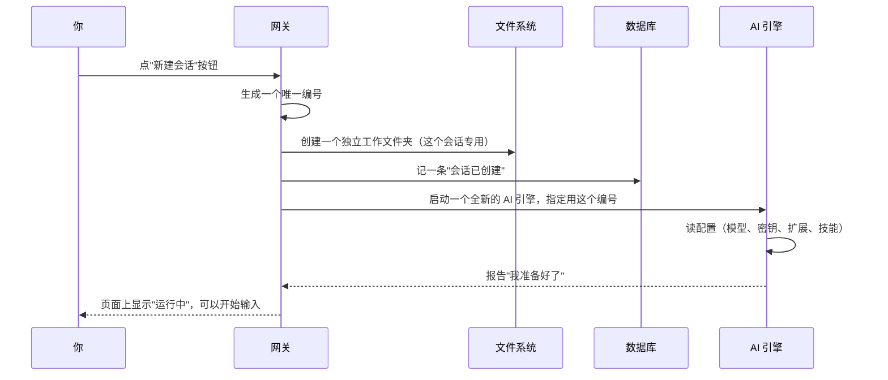
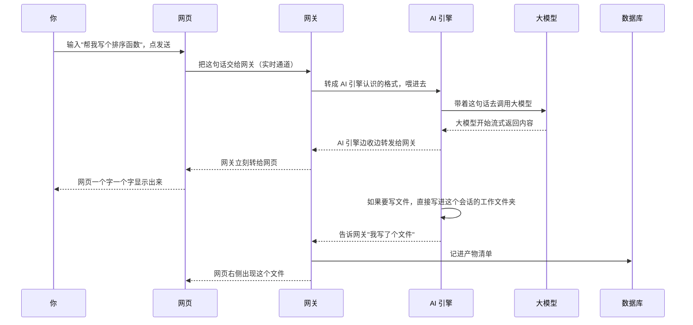
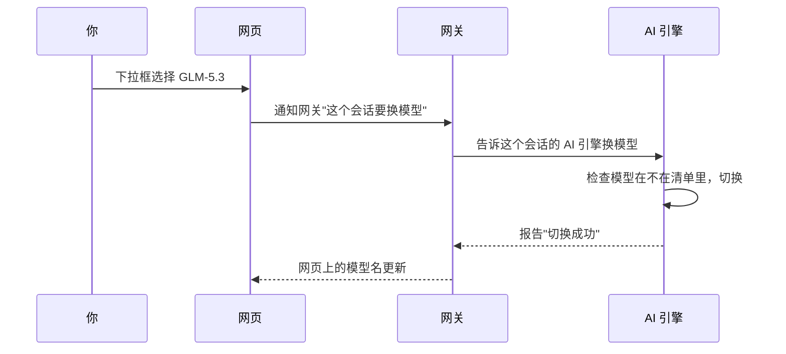
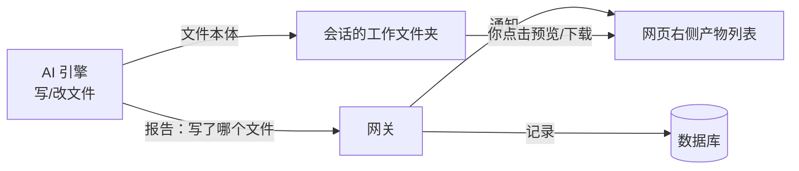

# pi-web 全链路说明

这篇文章把 pi-web 从"你打开网页"到"AI 把文件存下来"的完整过程讲一遍。
不涉及代码细节，只说发生了什么、为什么。

---

## 1. 这套系统由哪几部分组成

就三样东西在配合：

1. **网页**（浏览器里看到的那个界面）
2. **网关**（项目里的一个中间程序，专门负责在网页和 AI 之间传话，顺便记账、看门）
3. **AI 引擎**（真正的干活者，每个会话会单独启动一个。它负责思考、调用大模型、读写文件）

再加上两个"仓库"：
- **数据库**（一个文件，记录会话列表、产物清单这类信息，重启不丢）
- **AI 引擎的配置目录**（放着模型清单、密钥、扩展、技能）



**一句话**：网页负责显示，AI 引擎负责干活，网关负责在中间传话和管理。

---

## 2. 两种跑法

这个项目有两种运行方式，区别只在"AI 引擎从哪里来、配置放哪"：

| | 直接跑（本机模式） | 用 Docker 跑 |
|---|---|---|
| 适合谁 | 自己电脑上开发调试 | 想干净地部署一套给别人用 |
| AI 引擎 | 用你电脑上装的那份 | 用容器里单独装的一份 |
| 配置/密钥放哪 | 你电脑的用户目录（和你平时用的 pi 共用） | 容器自己的独立空间（和你电脑完全隔离） |
| 数据放哪 | 项目文件夹里的 data 目录 | 容器映射出来的 data 目录 |

**Docker 的意义**：把整个项目连同 AI 引擎打包成一个"盒子"，在哪个电脑上打开都一样，不会用到那台电脑自己装的东西。

---

## 3. Docker 这个盒子里装了些什么



- **系统**：一个精简版 Linux
- **运行环境**：Node.js（网关靠它运行）
- **常用工具**：git、bash 这些（AI 引擎干活时要用它们操作文件、跑命令）
- **AI 引擎**：单独安装的一份，版本固定
- **网关和网页**：项目的代码

**数据不装在盒子里**，而是放在盒子外面的两个地方（这样盒子重建、更新，数据不丢）：
1. **数据目录**：会话记录、工作区文件、数据库
2. **配置空间**：模型清单、密钥、扩展、技能

---

## 4. 从启动到能用，发生了什么



启动后网关就一直在那等着：接待网页请求、看着 AI 引擎有没有出问题。

---

## 5. 你点"新建会话"，发生了什么



**重点**：每个会话都是**全新的一套**——新的编号、新的文件夹、新的 AI 引擎进程。谁都不碰谁的东西。

**如果 AI 引擎启动时崩溃了**：网关会检测到，在左边列表上标"已崩溃"，并把错误信息存下来给你看；你点一下就能重新拉起。

---

## 6. 你输入一句话，到看到回答，全流程

这是最核心的一条线：



几个关键点：

- **实时通道**：网页和网关之间有一条保持不断开的连接，所以内容才能一个字一个字地蹦出来，不用等你刷新。
- **断线了怎么办**：网页会自动重连，连上后问网关"这个会话现在到哪了"，网关把当前状态补给它。
- **中间断了（停止按钮）**：网页告诉网关，网关告诉 AI 引擎，AI 引擎立刻停止。

---

## 7. 切换模型，发生了什么



**几个常识**：

- **换模型只影响当前会话**，别的会话还是自己的模型。
- **思考级别**（thinking 强度）也是单独设置的，同样只影响当前会话。
- **新会话默认用什么模型**：由配置目录里的默认设置决定。
- **模型和思考级别能不能选**：看模型支持什么。比如 GLM-5.3 只有"低/中/高"三档思考强度，而且不能关闭思考，所以界面上不会给你"关闭"这个选项。

---

## 8. 工作产物是怎么存下来的

AI 引擎写文件时，分两条线：

1. **文件本身**：AI 引擎直接把文件写进**这个会话自己的工作文件夹**里
2. **记录**：AI 引擎写完会报告"我写了文件 X"，网关把这条记录存进数据库（文件路径、大小、类型、时间），并推给网页，网页右侧"产物"列表就出现它



**安全**：网关会检查 AI 引擎写的路径是不是在这个会话的工作文件夹里，想写到外面去（比如系统目录）会被拦下。

**删除会话**：工作文件夹整个删掉，数据库里的记录也一起清掉。

---

## 9. 数据都放在哪

```
数据目录（本机是 data/，Docker 是 docker/data/）
├── 访问口令          # 打开网页要用它验证身份
├── 数据库            # 会话列表/设置/产物记录
├── 会话记录          # 每个会话的完整对话存档
├── 工作区            # 每个会话一个文件夹，文件都在这
└── 其他配置          # MCP 之类的

配置空间（本机是用户目录，Docker 是容器独立空间）
├── 模型清单          # 有哪些模型、怎么调用
├── 密钥              # 各家大模型的 API key
├── 设置              # 默认模型、默认思考级别
├── 扩展和技能        # 额外能力
```

---

## 10. 一分钟回顾

- **网页** = 显示和操作界面
- **网关** = 中间程序：传话、记账、看门、管理 AI 引擎
- **AI 引擎** = 每个会话一个，真正调用大模型、读写文件
- **新建会话** = 新编号 + 新文件夹 + 新 AI 引擎，完全独立
- **输入到回复** = 网页 → 网关 → AI 引擎 → 大模型，原路返回，实时显示
- **切模型** = 只影响当前会话
- **产物** = 文件进工作文件夹，记录进数据库，右侧列表展示
- **Docker** = 打包成盒子，盒子里的引擎和配置与你电脑隔离，数据放盒子外的卷里
